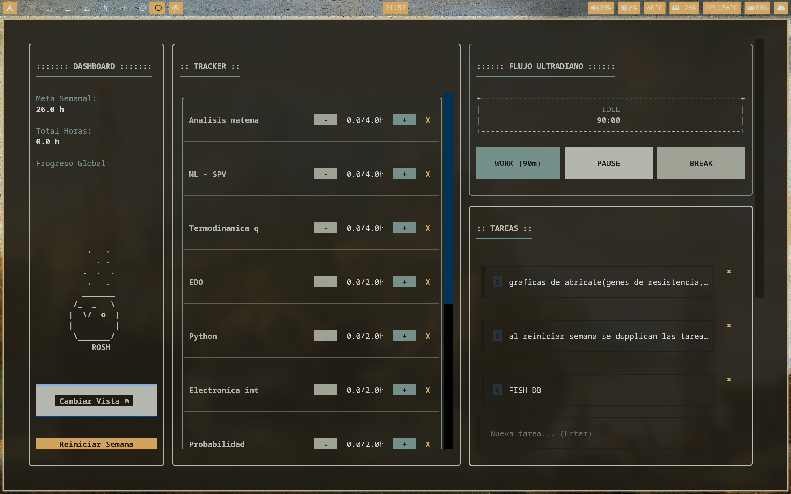

# ⚙️ Terminal Study Tracker

A Terminal User Interface (TUI) application built in Python for comprehensive study time management. It combines weekly goal tracking, to-do lists, and a dynamic ultradian flow engine, all under a terminal aesthetic inspired by `btop`.



## 🚀 Key Features

* **Subject Tracking (Tracker):** Log your study hours against weekly goals. Includes reactive progress bars.
* **Ultradian Rhythm Engine:** Unlike a static Pomodoro, it implements 90-minute work cycles with dynamic break calculation based on actual effort (1:6 ratio).
* **Task Management (To-Do):** Fast and persistent system for to-do lists integrated directly into the dashboard.
* **God Mode (Dashboard):** Toggle between an organized tabbed view and a global "Dashboard" that displays all widgets simultaneously.
* **Data Persistence:** Automatically saves progress and metrics in a JSON format (`progress.json`).

## 🧠 Architecture and Logic

The system is divided into three modular components:
1. `tui_app.py`: Handles the Textual application lifecycle, widget reactivity, and event routing.
2. `logic.py`: Contains the data classes (`Materia`), serialization, and the mathematical engine for calculating break intervals.
3. `estilo.css`: Defines the layout (CSS adapted for TUIs), including dynamic classes for progress bars and compatibility with color scheme managers.

## 🛠️ Installation and Usage

### Prerequisites
Ensure you have Python 3.8+ installed. Install the main interface dependency:

```bash
pip install textual

```

### Execution

Clone the repository and run the main script:

```bash
git clone [https://github.com/RoshTzsche/study-tracker-tui.git](https://github.com/RoshTzsche/study-tracker-tui.git)
cd study-tracker-tui
python tui_app.py

```

## 🎨 Customization and Themes

The interface is designed to integrate natively with custom Linux environments (WMs, dotfiles). The `estilo.css` file is configured to read color variables from **Pywal**:

* Modify the path in `tui_app.py` (`~/.cache/wal/textual.tcss`) if you use a different color palette generator.
* Visual components dynamically inherit `$background`, `$foreground`, `$primary`, and `$accent` from the system's terminal.

## ⌨️ Controls

* `Click / Enter` - Interact with buttons and text inputs.
* `Tab` - Navigate between UI components.
* `q` - Exit the application and save progress.
```
